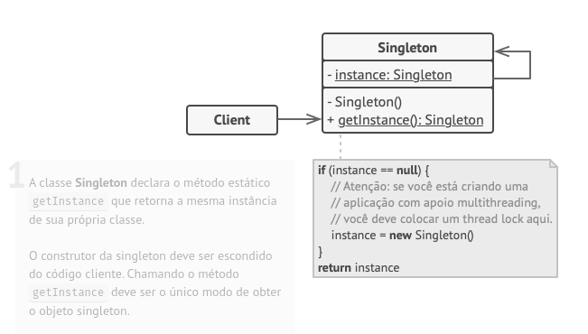
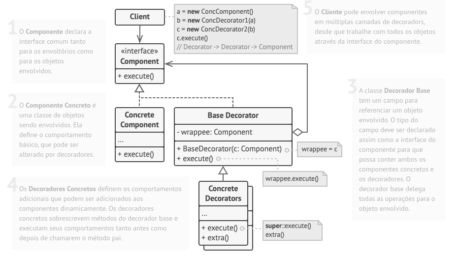
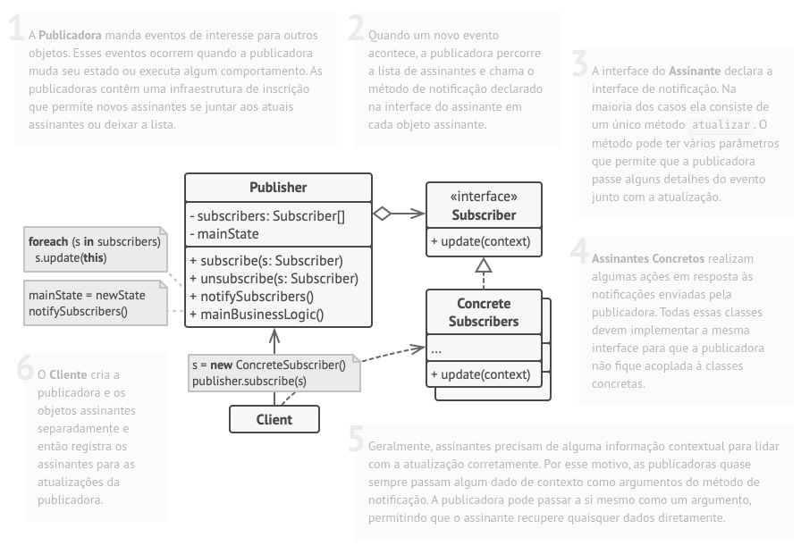

# Singleton:
O padrão Singleton é um dos padrões de design mais simples e frequentemente usados. Ele garante que uma classe tenha apenas uma instância e fornece um ponto global de acesso a essa instância.

## Exemplo:
```python:
class SingletonMeta(type):
    """
    The Singleton class can be implemented in different ways in Python. Some
    possible methods include: base class, decorator, metaclass. We will use the
    metaclass because it is best suited for this purpose.
    """

    _instances = {}

    def __call__(cls, *args, **kwargs):
        """
        Possible changes to the value of the `__init__` argument do not affect
        the returned instance.
        """
        if cls not in cls._instances:
            instance = super().__call__(*args, **kwargs)
            cls._instances[cls] = instance
        return cls._instances[cls]


class Singleton(metaclass=SingletonMeta):
    def some_business_logic(self):
        """
        Finally, any singleton should define some business logic, which can be
        executed on its instance.
        """

        # ...


if __name__ == "__main__":
    # The client code.

    s1 = Singleton()
    s2 = Singleton()

    if id(s1) == id(s2):
        print("Singleton works, both variables contain the same instance.")
    else:
        print("Singleton failed, variables contain different instances.")
```
## UML Singleton:


# Decorator:

## Exemplo:

```python:
class Component():
    """
    The base Component interface defines operations that can be altered by
    decorators.
    """

    def operation(self) -> str:
        pass


class ConcreteComponent(Component):
    """
    Concrete Components provide default implementations of the operations. There
    might be several variations of these classes.
    """

    def operation(self) -> str:
        return "ConcreteComponent"


class Decorator(Component):
    """
    The base Decorator class follows the same interface as the other components.
    The primary purpose of this class is to define the wrapping interface for
    all concrete decorators. The default implementation of the wrapping code
    might include a field for storing a wrapped component and the means to
    initialize it.
    """

    _component: Component = None

    def __init__(self, component: Component) -> None:
        self._component = component

    @property
    def component(self) -> Component:
        """
        The Decorator delegates all work to the wrapped component.
        """

        return self._component

    def operation(self) -> str:
        return self._component.operation()


class ConcreteDecoratorA(Decorator):
    """
    Concrete Decorators call the wrapped object and alter its result in some
    way.
    """

    def operation(self) -> str:
        """
        Decorators may call parent implementation of the operation, instead of
        calling the wrapped object directly. This approach simplifies extension
        of decorator classes.
        """
        return f"ConcreteDecoratorA({self.component.operation()})"


class ConcreteDecoratorB(Decorator):
    """
    Decorators can execute their behavior either before or after the call to a
    wrapped object.
    """

    def operation(self) -> str:
        return f"ConcreteDecoratorB({self.component.operation()})"


def client_code(component: Component) -> None:
    """
    The client code works with all objects using the Component interface. This
    way it can stay independent of the concrete classes of components it works
    with.
    """

    # ...

    print(f"RESULT: {component.operation()}", end="")

    # ...


if __name__ == "__main__":
    # This way the client code can support both simple components...
    simple = ConcreteComponent()
    print("Client: I've got a simple component:")
    client_code(simple)
    print("\n")

    # ...as well as decorated ones.
    #
    # Note how decorators can wrap not only simple components but the other
    # decorators as well.
    decorator1 = ConcreteDecoratorA(simple)
    decorator2 = ConcreteDecoratorB(decorator1)
    print("Client: Now I've got a decorated component:")
    client_code(decorator2)
```

## UML Decorator:


# Observer:

## Exemplo:

```python:
from __future__ import annotations
from abc import ABC, abstractmethod
from random import randrange
from typing import List


class Subject(ABC):
    """
    The Subject interface declares a set of methods for managing subscribers.
    """

    @abstractmethod
    def attach(self, observer: Observer) -> None:
        """
        Attach an observer to the subject.
        """
        pass

    @abstractmethod
    def detach(self, observer: Observer) -> None:
        """
        Detach an observer from the subject.
        """
        pass

    @abstractmethod
    def notify(self) -> None:
        """
        Notify all observers about an event.
        """
        pass


class ConcreteSubject(Subject):
    """
    The Subject owns some important state and notifies observers when the state
    changes.
    """

    _state: int = None
    """
    For the sake of simplicity, the Subject's state, essential to all
    subscribers, is stored in this variable.
    """

    _observers: List[Observer] = []
    """
    List of subscribers. In real life, the list of subscribers can be stored
    more comprehensively (categorized by event type, etc.).
    """

    def attach(self, observer: Observer) -> None:
        print("Subject: Attached an observer.")
        self._observers.append(observer)

    def detach(self, observer: Observer) -> None:
        self._observers.remove(observer)

    """
    The subscription management methods.
    """

    def notify(self) -> None:
        """
        Trigger an update in each subscriber.
        """

        print("Subject: Notifying observers...")
        for observer in self._observers:
            observer.update(self)

    def some_business_logic(self) -> None:
        """
        Usually, the subscription logic is only a fraction of what a Subject can
        really do. Subjects commonly hold some important business logic, that
        triggers a notification method whenever something important is about to
        happen (or after it).
        """

        print("\nSubject: I'm doing something important.")
        self._state = randrange(0, 10)

        print(f"Subject: My state has just changed to: {self._state}")
        self.notify()


class Observer(ABC):
    """
    The Observer interface declares the update method, used by subjects.
    """

    @abstractmethod
    def update(self, subject: Subject) -> None:
        """
        Receive update from subject.
        """
        pass


"""
Concrete Observers react to the updates issued by the Subject they had been
attached to.
"""


class ConcreteObserverA(Observer):
    def update(self, subject: Subject) -> None:
        if subject._state < 3:
            print("ConcreteObserverA: Reacted to the event")


class ConcreteObserverB(Observer):
    def update(self, subject: Subject) -> None:
        if subject._state == 0 or subject._state >= 2:
            print("ConcreteObserverB: Reacted to the event")


if __name__ == "__main__":
    # The client code.

    subject = ConcreteSubject()

    observer_a = ConcreteObserverA()
    subject.attach(observer_a)

    observer_b = ConcreteObserverB()
    subject.attach(observer_b)

    subject.some_business_logic()
    subject.some_business_logic()

    subject.detach(observer_a)

    subject.some_business_logic()
```

## UML Observer:



